# TreasureHuntClab - 🏴‍☠️ Treasure Hunt Game - STM32F303 Discovery

```
████████████████████████████████████████████████████████████████████████████████
██                                                                            ██
██   ████████ ████████ ████████  ████   ████████ ██    ██ ████████ ████████   ██
██      ██    ██    ██ ██       ██  ██  ██       ██    ██ ██    ██ ██         ██
██      ██    ████████ ██████   ██████  ██████   ██    ██ ████████ ██████     ██
██      ██    ██   ██  ██       ██  ██  ██       ██    ██ ██   ██  ██         ██
██      ██    ██    ██ ████████ ██  ██  ████████ ████████ ██    ██ ████████   ██
██                                                                            ██
██   ██    ██ ██    ██ ██    ██ ████████                                      ██
██   ██    ██ ██    ██ ███   ██    ██                                         ██
██   ████████ ██    ██ ██ ██ ██    ██                                         ██
██   ██    ██ ██    ██ ██   ███    ██                                         ██
██   ██    ██ ████████ ██    ██    ██                                         ██
██                                                                            ██
████████████████████████████████████████████████████████████████████████████████
```

```
███╗   ███╗████████╗██████╗ ██╗  ██╗██████╗ ███████╗ ██████╗  ██████╗ 
████╗ ████║╚══██╔══╝██╔══██╗╚██╗██╔╝╚════██╗╚════██║██╔═████╗██╔═████╗
██╔████╔██║   ██║   ██████╔╝ ╚███╔╝  █████╔╝    ██╔╝██║██╔██║██║██╔██║
██║╚██╔╝██║   ██║   ██╔══██╗ ██╔██╗ ██╔═══╝    ██╔╝ ████╔╝██║████╔╝██║
██║ ╚═╝ ██║   ██║   ██║  ██║██╔╝ ██╗███████╗   ██║  ╚██████╔╝╚██████╔╝
╚═╝     ╚═╝   ╚═╝   ╚═╝  ╚═╝╚══════╝   ╚═╝   ╚═════╝  ╚═════╝ 
```
[](https://www.st.com/en/microcontrollers-microprocessors/stm32f303.html)
[](https://en.wikipedia.org/wiki/C_(programming_language))
[](https://www.st.com/en/embedded-software/stm32cube-mcu-mpu-packages.html)
[](https://en.wikipedia.org/wiki/Real-time_computing)
[](docs/)

## 🎯 Project Overview

This repository contains a technology-driven Treasure Hunt that incorporates elements of classic treasure hunts within MTRX2700 Mechatronics 2 unit at the University of Sydney. It is an immersive treasure hunting adventure game built on the STM32F303 Discovery Board. Players use capacitive touch sensors to select "treasure boxes" (controlled by servos) and a potentiometer to "dig" (open the servos). The goal is to find hidden treasures within a set number of digs and a limited time. This project demonstrates advanced embedded systems integration including sensor interfacing, actuator control, real-time processing, and serial communication for game control and status updates.
For a more detailed technical breakdown, please see the [Technical Documentation (docs.md)](docs.md).

### Game Features
- **Interactive Touch Controls**: 6 capacitive touch sensors (`PB3, PB4, PB5, PB6, PB7, PB13`) allow players to select one of six treasure boxes.
- **Servo-Controlled Chambers**: 6 servo motors, each corresponding to a touch sensor, control the lids of the treasure boxes.
- **Peek/Dig Mechanics**:
    - **Peek**: Players can rotate the potentiometer to partially open a selected box (up to `PEEK_MAX_ANGLE`, e.g., 20 degrees). If the box is closed from this state, it counts as a "peek used," and the player can choose another action or box.
    - **Dig**: If the player opens the box beyond `PEEK_MAX_ANGLE`, it commits to a full dig. The box must be fully opened (e.g., 90 degrees) and then fully closed. This action consumes one "dig remaining" and disables the used touchpad for the rest of the game.
- **Real-Time Scoring**: Treasures found during a dig contribute to the `current_score` based on their predefined value.
- **Time Management**: A configurable countdown timer (default: 240 seconds) adds urgency. The game ends if time runs out.
- **Resource Limitations**: Players have a limited number of digs (default: 4) and peeks.
- **Serial Interface**:
    - Real-time game state monitoring (score, digs, treasures, peeks, time).
    - Configurable game start via serial commands (e.g., custom treasure map, digs, time).
- **Game States**: Clear start menu, active gameplay, and game over (win/lose) states with a final scoreboard.

### Gameplay Mechanics

**Objective**: Find all hidden treasures (or maximize score) before time runs out or digs are exhausted.

**Controls**:
- **Touch to Arm**: Touch one of the 6 sensor pads. This "arms" the corresponding treasure box. The system indicates which pad is armed.
- **Potentiometer to Activate & Control**:
    - Once a pad is armed, rotating the potentiometer above a `POT_ACTIVE_THRESHOLD_RAW` activates control over the armed box.
    - Further rotation controls the servo angle for that box.
- **Peek Mode**: Rotate the potentiometer to open the active box's lid up to `PEEK_MAX_ANGLE` (e.g., 20 degrees). If the lid is then closed by rotating the potentiometer back, one `peeks_used` is consumed. The touchpad remains available.
- **Dig Mode**:
    - Rotate the potentiometer to open the active box's lid beyond `PEEK_MAX_ANGLE`. This commits to a "dig."
    - The lid must be opened to `SERVO_TARGET_OPEN_ANGLE` (e.g., 90 degrees). This action consumes one `digs_remaining` and updates treasure status if found.
    - Then, the lid must be closed back to `SERVO_TARGET_CLOSED_ANGLE` (e.g., 0 degrees).
    - Once the dig cycle (full open and full close) is complete, the touchpad used for this dig is disabled for the current game.

**Strategy Elements**:
- **Limited Digs**: Default 4 digs. Use them wisely.
- **Peek Advantage**: Use peeks to identify treasure locations without consuming a valuable dig.
- **Time Pressure**: Default 240 seconds (4 minutes).
- **Scoring**: Treasures have different values. Finding treasures adds to `current_score`.
- **One-Time Use Touchpads (Post-Dig)**: Once a box has been successfully "dug", its corresponding touchpad cannot be used to initiate another dig or peek in the same game.

For a detailed explanation of the game mechanics, including the peek/dig logic and state transitions, please refer to the [Gameplay Mechanics and State Machine section in docs.md](docs.md#7-code-flow-and-state-machine-main-loop-in-mainc).

### Software Architecture

```
┌─────────────────────────────────────────────────────────────────┐
│                        Main Game Loop                           │
├─────────────────────────────────────────────────────────────────┤
│  ┌─────────────────┐  ┌─────────────────┐  ┌─────────────────┐  │
│  │   Touch Input   │  │  Servo Control  │  │   Game Logic    │  │
│  │   Management    │  │   & Trimpot     │  │   & Scoring     │  │
│  └─────────────────┘  └─────────────────┘  └─────────────────┘  │
├─────────────────────────────────────────────────────────────────┤
│  ┌─────────────────┐  ┌─────────────────┐  ┌─────────────────┐  │
│  │  Timer System   │  │ Serial Comms    │  │  State Machine  │  │
│  │  & Interrupts   │  │ & Configuration │  │  Management     │  │
│  └─────────────────┘  └─────────────────┘  └─────────────────┘  │
└─────────────────────────────────────────────────────────────────┘
```
---

## Team Members & Roles
- **Joshua Kim** (`530478283`) - Touch control, Game logic, Integration
- **Steven Hughes** (`311246486`) - 3D PRINT MAN
- **Aryan Rai** (`530362258`) - EVERYTHING
- **James**   (`530439147`) - THE HARDWARE CARRY
- **Noah** - TRIMPOT MOTRO LEGEND

---

## 📁 Repository Structure
```
TreasurehuntClab/
├── 📂 Archive/                  # Development Archive
├── 📂 MagnetometerLedBuzzer/    # Magnetometer Implementation
├── 📂 integration/              # Development Archive
├── 📂 Integration_final/        # Implementation
│   ├── 📂 src/              # Source File Integration
│   └── 📂 inc               # Header files

```

---

## Module Descriptions

### Serial Communication

The Serial Interface module contains the necessary files for UART output and input:
- `main.c`: Contains the main function loop with alternate loops allowing for either polling or interrupts
- `serial.c`: Contains alterable functions that contain the majority of functions with relation to UART;
    - **String Ouput**: Send string using UART to USB conversion
    - **String Input**: Receive strings into buffer until terminating character and NULL appends string
    - **Interrupts**: Enables interrupts and interrupt handling instead of polling
- `serial.h`: Header file with function prototypes and defintions within `serial.c`

### GPIO

GPIO class that instantatiates any gpio:
```c
init_port(port_name_link name, port_mode mode, uint8_t pin_lower, uint8_t pin_upper)

```

This class also sets up intertups, input or output or analog along with callback functions.

### Timer

The timer module has many features, which are listed below. They are defined in `timer.h`, and implemented in `timer.c`:
- Multiple Timers: Multiple timers can be used concurrently, and are chosen via the `enum TimerSel`
- Callbacks: A callback can be set, which is called every timer event
- Silencing: The timers can be silenced so that events still occur, but without the callback
- Recurring: Timers can be set to recur or to silence themselves on the next event.
- Timings: Both the period and the prescaler of the timers can be controlled
- Interrupts: Interrupts are used for all timers, which all funnel into `_timer_interrupt_handler()`

### Touchpad

Using GPIO class to set up GPIOB pins 3, 4, 5, 6, 7, and 13 as touch sensors. Interrupts for each pin are enabled with the callback function `handle_touch`:

```c
enable_interupt(touch_pads_pb, 3, RISING_EDGE, 0, &handle_touch); // PB3
```

The callback function `handle_touch()` processes touch events and maps them to corresponding servos. Key features:
- **Touch Mapping**: Each touchpad corresponds to a specific servo (defined in `touch_to_servo_map`)
- **Usage Tracking**: Touchpads are disabled after being used for a dig to prevent reuse
- **Game Integration**: Touch events trigger servo activation when combined with trimpot input
- **State Management**: Touch processing is enabled/disabled based on game mode and active servo control

### Servo Control


### Magnetometer


### Trimpot

The trimpotentiometer (connected to PA4) serves as the primary control interface for servo operation:


### Integration (Main.c)
Main function that integrates all submodules together. See

## Technical Implementation

For comprehensive details on hardware connections, core data structures, function descriptions, serial commands, and more, please refer to the [Technical Documentation (docs.md)](docs.md).

### Core Data Structures

```c
typedef struct{
	volatile int correct_servos[6];
	volatile int items_found;
	volatile int items_left_to_find;
	volatile int digs_taken;
	volatile int digs_remaining;
	volatile int peeks_used;
	volatile int game_time_remaining;
	volatile int game_over;
	volatile int total_items_to_find;
	volatile int current_score;
} GameState;


typedef struct{
	volatile int touchpad_pressed;
	volatile int magnet1_det;
	volatile int magnet2_det;
	volatile int servo_controlled;
	volatile int servo_angle;
	volatile int trimpot_value;
	volatile int peek_threshold;
	volatile int pending_peek;
} GameTriggers;

```

### Key Functions

#### Game Management
- `start_game()`: Initialize new game session
- `check_game_over()`: Evaluate win/lose conditions  
- `transmit_game_state()`: Send status via UART

#### Hardware Interface
- `handle_touch()`: Process touch sensor interrupts
- `SetServoAngle()`: Control servo positioning
- `dig_used()`: Process dig completion logic

#### Serial Communication
- `input_callback()`: Parse incoming commands
- `parse_game_config()`: Extract game parameters

### Interrupt Service Routines

```c
// Touch sensor interrupt handler
void EXTI3_IRQHandler(void) { /* Handle touch events */ }

// Timer interrupt for game countdown
static void fn_a(TimerSel sel) { /* Update game timer */ }

// UART receive interrupt
void input_callback(char *data, uint32_t len) { /* Process commands */ }
```

### State Machine Logic

The game operates on a sophisticated state machine managing:

1. **Idle State**: Waiting for touch input
2. **Armed State**: Touch registered, waiting for pot activation
3. **Peek State**: Limited servo control (0-20°)
4. **Dig State**: Full servo control with commit logic
5. **Completion State**: Action finished, updating game state

## Detailed Gameplay

### Game States

```mermaid
stateDiagram-v2
    [*] --> GameOver: System Boot
    GameOver --> GameActive: "game start" command
    GameActive --> PeekMode: Touch + Pot < 20°
    GameActive --> DigMode: Touch + Pot > 20°
    PeekMode --> GameActive: Servo closed
    DigMode --> GameActive: Full cycle complete
    GameActive --> GameOver: Win/Lose/Timeout
```



### Control Mechanics

#### Touch-Pot Interaction System

1. **Arming Phase**
   - Touch any sensor pad to "arm" it
   - LED feedback confirms touch registration
   - Multiple touches override previous selection

2. **Activation Phase**  
   - Rotate trimpot past threshold (>50 ADC units)
   - Armed touchpad becomes active controller
   - Other touches ignored during active phase

3. **Servo Control Phase**
   ```
   Pot Position    Servo Angle    Action
   0-20°          0-20°          Peek Mode
   20°+           20-90°         Dig Commit Mode
   ```

4. **Completion Phase**
   - **Peek**: Return to 0° to complete peek action
   - **Dig**: Open to 90°, then close to 0° to complete dig
   - Touchpad disabled after dig completion

### Scoring System

| Treasure Type | Point Value | 
|---------------|-------------|
| Basic Treasure | 4 points |
| Rare Treasure | 8 points | 
| Epic Treasure | 12+ points | 

**Bonus Scoring**:
- Time bonus for quick completion
- Efficiency bonus for fewer digs used
- Peek penalty minimization

### Win/Lose Conditions

**Victory Conditions**:
- Find all treasures before time/digs run out
- Maximize score through efficient play

**Defeat Conditions**:
- Time expires (240 seconds default)
- All digs consumed without finding treasures
- No treasures remaining but insufficient resources

---

## Quick User Instructions

### Prerequisites

- **Hardware**: STM32F303 Discovery Board
- **Software**: STM32CubeIDE or compatible ARM development environment
- **Tools**: USB cable, serial terminal (PuTTY, Tera Term, or Arduino Serial Monitor)
- **Components**: Touch sensors, servo motors, potentiometer (see hardware section)

### Installation & Setup

1. **Clone Repository**
   ```bash
   git clone https://github.com/AryanRai/TreasureHuntClab.git
   cd TreasureHuntClab
   ```

2. **Hardware Assembly** (Refer to `main.c` `MX_GPIO_Init` and peripheral initializations for pin details)
    -   **Touch Sensors (Input, Pull-down, EXTI on Rising Edge)**:
        -   PB3 (EXTI3)
        -   PB4 (EXTI4)
        -   PB5 (EXTI9_5)
        -   PB6 (EXTI9_5)
        -   PB7 (EXTI9_5)
        -   PB13 (EXTI15_10)
    -   **Servo Motors (PWM Output)**:
        -   Servo 1: PE2 (TIM3_CH1)
        -   Servo 2: PE3 (TIM3_CH2)
        -   Servo 3: PA0 (TIM2_CH1)
        -   Servo 4: PA1 (TIM2_CH2)
        -   Servo 5: PD12 (TIM4_CH1)
        -   Servo 6: PD13 (TIM4_CH2)
    -   **Trimpot (Analog Input)**:
        -   PA4 (Connected to ADC, specific ADC channel depends on `read_pins_analog` in `GPIO.c`, likely ADC2_INP4 if using PA4 with the custom lib). Note: `main.c` uses `GPIO *trim_pot = init_port(A, ANALOG, 4, 4);` and `read_pins_analog(trim_pot, &pot_raw_value);`
    -   **Serial UART (USART1)**:
        -   TX: PC4 (AF7)
        -   RX: PC5 (AF7)
    -   Ensure proper power supply, especially for servo motors (typically 5V and may require a separate supply from the STM32 board if drawing significant current).

3. **Software Configuration**
    -   Open the project `integration/Integration_final/MainBoard/` in STM32CubeIDE (or your preferred IDE).
    -   Ensure the STM32CubeMX configuration (if used to generate the base project) matches the peripherals and pins used in `main.c` (TIM2, TIM3, TIM4 for PWM; USART1 for serial; GPIOs for touch, ADC for trimpot; EXTI for touch interrupts). The `main.c` directly initializes these using HAL and custom libraries.
    -   The system clock is configured in `SystemClock_Config()`.
    -   Build the project and flash it to the STM32F303 Discovery Board.

4. **Serial Interface Setup**
    -   Connect to the STM32's USB ST-LINK Virtual COM Port using a serial terminal program (e.g., PuTTY, Tera Term, Arduino IDE Serial Monitor).
    -   Baud Rate: 115200
    -   Data Bits: 8
    -   Parity: None
    -   Stop Bits: 1
    -   Line Ending for sending commands: `\r` (Carriage Return)

### First Game

1. **Power On**: Connect board and open serial terminal
2. **Start Menu**: System displays welcome screen
3. **Begin Game**: Send `game start` command via serial
4. **Play**: Touch sensors to select chambers, use trimpot to control servos
5. **Strategy**: Peek at chambers first, then dig when confident

## Configuration & Customization

### Serial Commands

#### Basic Game Start
```
game start
```

#### Advanced Configuration
```
game start map=4,8,0,12,0,6 chances=5 time=300
```

**Parameters**:
- `map=a,b,c,d,e,f`: Treasure values for chambers 1-6 (0 = no treasure)
- `chances=n`: Number of digs allowed (default: 4)
- `time=n`: Game duration in seconds (default: 240)

#### Example Configurations

```bash
# Easy mode - More digs, more time
game start chances=6 time=360

# Hard mode - Limited resources
game start chances=3 time=180

# Custom treasure layout
game start map=10,0,5,0,15,8 chances=4 time=240
```

### Game State Monitoring

Real-time game information via serial output:
```
GAME STATE: Score: 12 | Digs Left: 2, Digs Taken: 2 | Treasures Left: 1, Treasures Found: 2 | Peeks Used: 3 | Time: 156
```
---

## Testing & Validation

## Testing
In order to test modules, the previously mentioned user instructions were used to set up and run the code, a demo of each module can be found in the next section labled **Demos**:

### Unit Tests

#### Touch Sensor Validation
```c
// Test each touch pad individually
for(int i = 0; i < 6; i++) {
    simulate_touch(i);
    verify_servo_mapping(i);
}
```

#### Servo Control Testing
```c
// Verify servo angle accuracy
for(int angle = 0; angle <= 90; angle += 10) {
    SetServoAngle(servo_id, angle);
    measure_actual_angle();
    validate_tolerance(angle, measured_angle, 3);
}
```

#### Game Logic Verification
```c
// Test win conditions
set_treasure_map({4, 8, 0, 0, 0, 0});
simulate_successful_digs(2);
assert(game.items_left_to_find == 0);
assert(check_game_over() == 1);
```

### Integration Tests

1. **Full Game Simulation**: Automated playthrough with known treasure map
2. **Edge Case Testing**: Boundary conditions for timers and resource limits
3. **Hardware Stress Testing**: Rapid servo movements and continuous operation

### Performance Metrics

| Metric | Target | Measured |
|--------|--------|----------|
| Touch Response Time | <50ms | ~25ms |
| Servo Position Accuracy | ±3° | ±2° |
| Timer Accuracy | ±1s over 4min | ±0.5s |
| Serial Throughput | 115200 baud | 115200 baud |

## Troubleshooting

### Common Issues

#### Touch Sensors Not Responding
**Symptoms**: No servo movement when touching pads
**Solutions**:
- Check pin connections (PB3-PB7, PB13)
- Verify interrupt configuration
- Test with oscilloscope for noise
- Ensure proper grounding

#### Servo Jitter or Incorrect Positioning  
**Symptoms**: Servos moving erratically or not reaching correct angles (0, peek angle, 90).
**Solutions**:
- Check power supply stability for servos (external 5V recommended, ensure common ground with STM32).
- Verify PWM signal timing (`PWM_MIN_PULSE`, `PWM_MAX_PULSE` in `main.c` define 0° and 180° pulse widths).
- Calibrate trimpot readings: The raw ADC value (`0` to `0xFFF` i.e. 4095) is mapped to servo angles. Ensure this mapping is correct for your potentiometer and desired servo range (0-90° in this game).
    - `POT_ACTIVE_THRESHOLD_RAW` (e.g., 50)
    - `PEEK_MAX_ANGLE` (e.g., 20)
    - `SERVO_TARGET_OPEN_ANGLE` (e.g., 90)
- Check for electrical interference or loose connections.

#### Serial Communication Issues
**Symptoms**: Commands not recognized or garbled output
**Solutions**:
- Verify baud rate (115200)
- Check UART pin connections
- Test with different terminal software
- Ensure proper line endings (CR/LF)

#### Game Logic Errors
**Symptoms**: Incorrect scoring, digs/peeks not counting, game not ending correctly, touchpads not disabling after digs.
**Solutions**:
- Monitor game state via serial output (`transmit_game_state()` and other debug messages in `main.c`).
- Check treasure map configuration (`correct_servos` array in `game` struct, and when starting with `map=` parameter).
- Verify peek/dig logic in the main loop, especially state transitions (`isActiveMode`, `inDigCommitPhase`, `servoFullyOpened`, `servoFullyClosed`) and conditions for calling `dig_used()` and `game.peeks_used++`.
- Test timer accuracy for `game_time_remaining`.
- Confirm `disable_touchpad()` is correctly called and functions as expected after a dig cycle.
- Ensure `armed_touchpad_pin` and `activeTouchpadPin` are managed correctly.

### Debug Features

#### Serial Debug Output
The `main.c` code contains numerous `serial_output_string()` calls that provide real-time feedback on:
- Game state changes (`transmit_game_state()`)
- Touch sensor arming and activation.
- Potentiometer values and corresponding servo angle commands.
- Transitions between peek and dig phases.
- Completion of peek and dig cycles.
- Treasure found/not found messages.
- Touchpad disabling events.
- Game start, win/lose conditions, and final scoreboard.
- Raw and trimmed serial input in `input_callback`.

To enhance debugging, you can add more specific `sprintf` and `serial_output_string` calls at critical points in the logic.

#### LED Status Indicators
(The current `main.c` does not explicitly define LED status indicators beyond what might be on the STM32F303 Discovery board by default. This section could be a future enhancement.)
- **Conceptual LED Usage**:
    - Heartbeat LED: Toggle an LED in the main loop or a timer to show the system is running.
    - Touch Armed LED: Light an LED when a specific touchpad is armed.
    - Active Mode LED: Light an LED when `isActiveMode` is true.
    - Game Over LED: Light an LED when `game.game_over` is true.


# End of Documentation