# TreasureHuntClab - 🏴‍☠️ Treasure Hunt Game - STM32F303 Discovery

```
████████████████████████████████████████████████████████████████████████████████
██                                                                            ██
██   ████████ ████████ ████████  ████   ████████ ██    ██ ████████ ████████   ██
██      ██    ██    ██ ██       ██  ██  ██       ██    ██ ██    ██ ██         ██
██      ██    ████████ ██████   ██████  ██████   ██    ██ ████████ ██████     ██
██      ██    ██   ██  ██       ██  ██  ██       ██    ██ ██   ██  ██         ██
██      ██    ██    ██ ████████ ██  ██  ████████ ████████ ██    ██ ████████   ██
██                                                                            ██
██   ██    ██ ██    ██ ██    ██ ████████                                      ██
██   ██    ██ ██    ██ ███   ██    ██                                         ██
██   ████████ ██    ██ ██ ██ ██    ██                                         ██
██   ██    ██ ██    ██ ██   ███    ██                                         ██
██   ██    ██ ████████ ██    ██    ██                                         ██
██                                                                            ██
████████████████████████████████████████████████████████████████████████████████
```

```
███╗   ███╗████████╗██████╗ ██╗  ██╗██████╗ ███████╗ ██████╗  ██████╗ 
████╗ ████║╚══██╔══╝██╔══██╗╚██╗██╔╝╚════██╗╚════██║██╔═████╗██╔═████╗
██╔████╔██║   ██║   ██████╔╝ ╚███╔╝  █████╔╝    ██╔╝██║██╔██║██║██╔██║
██║╚██╔╝██║   ██║   ██╔══██╗ ██╔██╗ ██╔═══╝    ██╔╝ ████╔╝██║████╔╝██║
██║ ╚═╝ ██║   ██║   ██║  ██║██╔╝ ██╗███████╗   ██║  ╚██████╔╝╚██████╔╝
╚═╝     ╚═╝   ╚═╝   ╚═╝  ╚═╝╚══════╝   ╚═╝   ╚═════╝  ╚═════╝ 
```
[](https://www.st.com/en/microcontrollers-microprocessors/stm32f303.html)
[](https://en.wikipedia.org/wiki/C_(programming_language))
[](https://www.st.com/en/embedded-software/stm32cube-mcu-mpu-packages.html)
[](https://en.wikipedia.org/wiki/Real-time_computing)
[](docs/)

## 🎯 Project Overview

This repository contains a technology-driven Treasure Hunt that incorporates elements of classic treasure hunts within MTRX2700 Mechatronics 2 unit at the University of Sydney. . It is an immersive treasure hunting adventure game built on the STM32F303 Discovery Board. Players use capacitive touch sensors to control servo-operated treasure chambers, employing strategic peek-and-dig mechanics within a time-pressured environment. This project demonstrates advanced embedded systems integration including sensor interfacing, actuator control, real-time processing, and serial communication.

### Game Features
- **Interactive Touch Controls**: 6 capacitive touch sensors (`PB3-PB7, PB13`)
- **Servo-Controlled Chambers**: 6 servo motors controlling treasure compartments
- **Peek/Dig Mechanics**: Preview chambers with limited peeks or commit to full digs
- **Real-Time Scoring**: Dynamic scoring system with treasure values
- **Time Management**: Adjustable-minute countdown with live updates
- **Resource Limitations**: Limited digs and peek actions
- **Serial Interface**: Real-time game state monitoring and configuration

### Gameplay Mechanics

**Objective**: Find all hidden treasures before time runs out or digs are exhausted

**Controls**:
- **Touch Activation**: Touch any sensor pad to arm it for control
- **Trimpot Control**: Rotate potentiometer to control servo angle
- **Peek Mode**: Partially open chambers (≤20°) to preview contents
- **Dig Mode**: Fully open chambers (90°) to extract treasures

**Strategy Elements**:
- **Limited Resources**: Only 4 digs available by default
- **Peek Advantage**: Use peeks to locate treasures without consuming digs
- **Time Pressure**: 4-minute countdown adds urgency
- **Scoring System**: Different treasures have different point values

### Software Architecture

```
┌─────────────────────────────────────────────────────────────────┐
│                        Main Game Loop                           │
├─────────────────────────────────────────────────────────────────┤
│  ┌─────────────────┐  ┌─────────────────┐  ┌─────────────────┐  │
│  │   Touch Input   │  │  Servo Control  │  │   Game Logic    │  │
│  │   Management    │  │   & Trimpot     │  │   & Scoring     │  │
│  └─────────────────┘  └─────────────────┘  └─────────────────┘  │
├─────────────────────────────────────────────────────────────────┤
│  ┌─────────────────┐  ┌─────────────────┐  ┌─────────────────┐  │
│  │  Timer System   │  │ Serial Comms    │  │  State Machine  │  │
│  │  & Interrupts   │  │ & Configuration │  │  Management     │  │
│  └─────────────────┘  └─────────────────┘  └─────────────────┘  │
└─────────────────────────────────────────────────────────────────┘
```
---

## Team Members & Roles
- **Joshua Kim** (`530478283`) - Touch control, Game logic, Integration
- **Steven Hughes** (`311246486`) - 3D PRINT MAN
- **Aryan Rai** (`530362258`) - EVERYTHING
- **James**   (`530439147`) - THE HARDWARE CARRY
- **Noah** - TRIMPOT MOTRO LEGEND

---

## 📁 Repository Structure
```
TreasurehuntClab/
├──
├──
├──
├── 📂 integration/           # Development Archive
├── 📂 Integration_final/    # Implementation
│   ├── 📂 Main/             # Integration
│   │   ├── 📄 send/         # Transmission
│   │   └── 📄 receive/      # Reception
│   └── 📂           
        ├── 📄 ex1/          # Memory Ops
        ├── 📄 ex2/          # I/O Control
        ├── 📄 ex3/          # UART Comms
        └── 📄 ex4/          # Timers
```

---

## Module Descriptions

### Serial Communication


### GPIO


### Servo Control


### Magnetometer


### Trimpot


### Integration (Main.c)

## Technical Implementation

### Core Data Structures

```c
typedef struct {
    uint8_t correct_servos[6];      // Treasure map (0 = no treasure)
    int items_found;                // Treasures discovered
    int items_left_to_find;         // Remaining treasures
    int digs_taken;                // Digs consumed
    int digs_remaining;            // Digs available
    int peeks_used;                // Peek actions used
    int game_time_remaining;       // Countdown timer
    int game_over;                 // Game state flag
    int total_items_to_find;       // Total treasures in game
    unsigned long current_score;    // Player score
} GameState;
```

### Key Functions

#### Game Management
- `start_game()`: Initialize new game session
- `check_game_over()`: Evaluate win/lose conditions  
- `transmit_game_state()`: Send status via UART

#### Hardware Interface
- `handle_touch()`: Process touch sensor interrupts
- `SetServoAngle()`: Control servo positioning
- `dig_used()`: Process dig completion logic

#### Serial Communication
- `input_callback()`: Parse incoming commands
- `parse_game_config()`: Extract game parameters

### Interrupt Service Routines

```c
// Touch sensor interrupt handler
void EXTI3_IRQHandler(void) { /* Handle touch events */ }

// Timer interrupt for game countdown
static void fn_a(TimerSel sel) { /* Update game timer */ }

// UART receive interrupt
void input_callback(char *data, uint32_t len) { /* Process commands */ }
```

### State Machine Logic

The game operates on a sophisticated state machine managing:

1. **Idle State**: Waiting for touch input
2. **Armed State**: Touch registered, waiting for pot activation
3. **Peek State**: Limited servo control (0-20°)
4. **Dig State**: Full servo control with commit logic
5. **Completion State**: Action finished, updating game state

## Detailed Gameplay

### Game States

```mermaid
stateDiagram-v2
    [*] --> GameOver: System Boot
    GameOver --> GameActive: "game start" command
    GameActive --> PeekMode: Touch + Pot < 20°
    GameActive --> DigMode: Touch + Pot > 20°
    PeekMode --> GameActive: Servo closed
    DigMode --> GameActive: Full cycle complete
    GameActive --> GameOver: Win/Lose/Timeout
```



### Control Mechanics

#### Touch-Pot Interaction System

1. **Arming Phase**
   - Touch any sensor pad to "arm" it
   - LED feedback confirms touch registration
   - Multiple touches override previous selection

2. **Activation Phase**  
   - Rotate trimpot past threshold (>50 ADC units)
   - Armed touchpad becomes active controller
   - Other touches ignored during active phase

3. **Servo Control Phase**
   ```
   Pot Position    Servo Angle    Action
   0-20°          0-20°          Peek Mode
   20°+           20-90°         Dig Commit Mode
   ```

4. **Completion Phase**
   - **Peek**: Return to 0° to complete peek action
   - **Dig**: Open to 90°, then close to 0° to complete dig
   - Touchpad disabled after dig completion

### Scoring System

| Treasure Type | Point Value | Rarity |
|---------------|-------------|--------|
| Basic Treasure | 4 points | Common |
| Rare Treasure | 8 points | Uncommon |
| Epic Treasure | 12+ points | Rare |

**Bonus Scoring**:
- Time bonus for quick completion
- Efficiency bonus for fewer digs used
- Peek penalty minimization

### Win/Lose Conditions

**Victory Conditions**:
- Find all treasures before time/digs run out
- Maximize score through efficient play

**Defeat Conditions**:
- Time expires (240 seconds default)
- All digs consumed without finding treasures
- No treasures remaining but insufficient resources

## Exercise Implementation Map

### Exercise 1: Memory and Pointers
- **Location**: `/Final/TASKS/ex1/`
- **Implementation**:
  - Case conversion (Task a)
  - Palindrome detection (Task b)
  - Caesar cipher (Task c)
- **Key Files**: 
  - `assembly_encode.s`: Case Change, Palindrome Check, Cipher Encode implementation
  - `assembly_decode.s`: Case Change, Palindrome Check, Cipher Decode implementation

### Exercise 2: Digital I/O
- **Location**: `/Final/TASKS/ex2/`
- **Implementation**:
  - LED pattern control (Task a)
  - Button-controlled LED sequence (Tasks b, c)
  - Vowel/consonant counter with LED display (Task d)
- **Key Files**:
  - `LED_Loader/Src.142ab.s`: LED pattern handling, input processing
  - `VOWELS/Src/CSIN4011_142_VOWELS.s`: Text analysis, LED display

### Exercise 3: Serial Communication
- **Location**: `/Final/TASKS/ex3/`
- **Implementation**:
  - String transmission (Task a): `uart_transmit_rec_basic`
  - String reception (Task b): `Serial_Task4`
  - Clock speed configuration (Task c): `uart_transmit_rec_speed_change`
  - Echo functionality (Task d): `Serial_Task4`
  - Dual UART port forwarding (Task e)
- **Key Files**:
  - `assembly.s`: Combined transmission and reception code
  - `initialise.s`: UART configuration and initialisation

### Exercise 4: Hardware Timers
- **Location**: `/Final/TASKS/ex4/`
- **Implementation**:
  - Microsecond delay function (Task a)
  - Prescaler configuration (Task b)
  - Hardware-managed delays (Task c)
- **Key Files**:
  - `assembly.s`: Delay implementation, LED pattern display
  - `initialise.s`: Timer setup

### Exercise 5: Integration
- **Location**: `/Final/Main/`
- **Implementation**:
  - Board-to-board communication
  - Palindrome detection and cipher
  - LED-based character analysis
- **Key Files**:
  - `send/main.s`: First board implementation
  - `receive/main.s`: Second board implementation

## Module Organization

### Exercise 1: Memory Operations
- Text processing and cipher implementations
- Case conversion (upper/lower)
- Palindrome detection
- Caesar cipher (encode/decode)
- Located in `/Final/TASKS/ex1/`

### Exercise 2: I/O Operations
- LED control and GPIO handling
- Button interface management
- Binary counting display
- Located in `/Final/TASKS/ex2/`

### Exercise 3: UART Communication
- Serial interface implementation
- Buffer management
- Message handling
- Located in `/Final/TASKS/ex3/`

### Exercise 4: Timer Operations
- Basic and advanced timer control
- LED patterns and delays
- Located in `/Final/TASKS/ex4/`

### Exercise 5: Integration
- Send/receive functionality
- Module coordination
- Located in `/Final/Main/`

---

## Quick User Instructions

### Prerequisites

- **Hardware**: STM32F303 Discovery Board
- **Software**: STM32CubeIDE or compatible ARM development environment
- **Tools**: USB cable, serial terminal (PuTTY, Tera Term, or Arduino Serial Monitor)
- **Components**: Touch sensors, servo motors, potentiometer (see hardware section)

### Installation & Setup

1. **Clone Repository**
   ```bash
   git clone https://github.com/AryanRai/TreasureHuntClab.git
   ```

2. **Hardware Assembly**
   - Connect touch sensors to pins PB3-PB7, PB13
   - Wire servo motors to PWM outputs (PE2, PE3, PA0, PA1, PD12, PD13)
   - Connect trimpot to PA4 (ADC input)
   - Ensure proper power supply for servos

3. **Software Configuration**
   - Open project in STM32CubeIDE
   - Configure clock settings for MHz operati
   - Enable required peripherals (TIM2, TIM3, TIM4, USART1, ADC)
   - Build and flash to Discovery Board

4. **Serial Interface Setup**
   - Baud Rate: 115200

### First Game

1. **Power On**: Connect board and open serial terminal
2. **Start Menu**: System displays welcome screen
3. **Begin Game**: Send `game start` command via serial
4. **Play**: Touch sensors to select chambers, use trimpot to control servos
5. **Strategy**: Peek at chambers first, then dig when confident

## Configuration & Customization

### Serial Commands

#### Basic Game Start
```
game start
```

#### Advanced Configuration
```
game start map=4,8,0,12,0,6 chances=5 time=300
```

**Parameters**:
- `map=a,b,c,d,e,f`: Treasure values for chambers 1-6 (0 = no treasure)
- `chances=n`: Number of digs allowed (default: 4)
- `time=n`: Game duration in seconds (default: 240)

#### Example Configurations

```bash
# Easy mode - More digs, more time
game start chances=6 time=360

# Hard mode - Limited resources
game start chances=3 time=180

# Custom treasure layout
game start map=10,0,5,0,15,8 chances=4 time=240
```

### Game State Monitoring

Real-time game information via serial output:
```
GAME STATE: Score: 12 | Digs Left: 2, Digs Taken: 2 | Treasures Left: 1, Treasures Found: 2 | Peeks Used: 3 | Time: 156
```


  
Below is a block diagram showing the communication between the two boards:


### General Timer Delay Formula

The time delay produced by a timer depends on its clock frequency and the number of ticks it counts. The key formula is:

Delay (seconds) = Number of Ticks × Tick Period (seconds)

Where:
- Tick Period = 1 / Timer Clock Frequency (Hz)
- Timer Clock Frequency = System Clock Frequency (Hz) / (Prescaler + 1)

#### Variables:

#### Specific Formulas for Your Code

#### 1. accurate_delay_us (Output Compare Mode)
This function delays for a duration specified in microseconds (passed in R1), using output compare channel 1 (TIM_CCR1).

Formula:
Delay (µs) = TIM_CCR1 × Tick Period (µs)
Where:
- Tick Period (µs) = 1 / Timer Clock Frequency (MHz)
- Timer Clock Frequency (MHz) = System Clock Frequency (MHz) / (PSC + 1)

Code Values:
- System Clock = 8 MHz (assumed HSI default)
- PSC = 7 (set via MOV R4, #7; STR R4, [R0, #TIM_PSC])
- TIM_CCR1 = R1 (e.g., 500000 in blink_leds)

Calculation:
1. Timer Clock Frequency = 8,000,000 / 8 = 1,000,000 Hz = 1 MHz
2. Tick Period = 1 / 1,000,000 = 1 µs
3. Delay = TIM_CCR1 × 1 µs

Example (blink_leds):
- R1 = 500000:
  - Delay = 500,000 × 1 µs = 500,000 µs = 500 ms = 0.5 seconds

#### 2. demo_100us (Update Event Mode)
This function generates a 0.1ms period and counts 10,000 periods to total 1 second.

Period Formula:
Period (µs) = (TIM_ARR + 1) × Tick Period (µs)
Note: +1 because counter resets after reaching ARR (counts from 0 to ARR inclusive)

Total Delay Formula:
Total Delay (µs) = (TIM_ARR + 1) × Number of Periods × Tick Period (µs)

Code Values:
- System Clock = 8 MHz
- PSC = 7 (1 MHz timer clock, 1 µs/tick)
- TIM_ARR = 100
- Number of Periods = 10,000

Calculation:
1. Timer Clock = 1 MHz (as above)
2. Tick Period = 1 µs
3. Period = (100 + 1) × 1 µs = 101 µs ≈ 0.1 ms
4. Total Delay = 101 × 10,000 × 1 µs = 1,010,000 µs = 1.01 seconds

For Exact 0.1ms:
- Use TIM_ARR = 99:
  - Period = (99 + 1) × 1 µs = 100 µs = 0.1 ms
  - Total = 100 × 10,000 × 1 µs = 1,000,000 µs = 1 second

---

## Testing & Validation

## Testing
In order to test modules, the previously mentioned user instructions were used to set up and run the code, a demo of each module can be found in the next section labled **Demos**:

### Task 1

Code testing involved valdating the aproach using various initial LED values, and various user button callbacks, including have the button set a state and toggle the state of each LED.

### Task 2

To assess the full functionality of the code, polling was used first by editting the code as commented in the files and using PuTTY. After this the following behaviour was observed:
- Output of string to PuTTY "man you're broke lol, get a job!!" and nothing else, awaiting for an input of a string
- After the string "no i'm not!!!" was typed onto PuTTY, the program output "You typed: no i'm not!!!" with a new line
- Then the program began the loop again outputting "man you're broke lol, get a job!!"
- This demonstrated the main loop polling for an input after being stuck after outputting a string

Next the interrupt functionality was tested by commenting and uncommenting the relevant lines in the code specified by comments resulting in the following behaviour:
- Continuous output of string "man you're broke lol, get a job!!" indicating the main loop able to continuously loop 
- After the string "no i'm not!!!" was input, the continuos output of the string stopped and instead output "You typed: no i'm not!!!" with a new line
- The program then went back to the main loop doing the same output
- This demonstrated the main loop being able to loop constantly while simutaneously looking for an input showing the functioning of an interrupt

### Task 3

The code in `main.c` demonstrates both recurring and oneshot timers. `TIM2` is used with `recur=true` to constantly cycle the leds. `TIM4` is used with `recur=false` to toggle the first led, with the timer being unsilenced inside the callback, a limited number of times.

The periods and prescalers can be modified to change the speed of the leds. The expected behaviour is a cycling pattern of leds, with the first led rapidly flashing `BLINK_COUNT` times. A demo video can be seen below.

### Task 4

The integration task was tested by testing each command, as listed in the module description.


### Unit Tests

#### Touch Sensor Validation
```c
// Test each touch pad individually
for(int i = 0; i < 6; i++) {
    simulate_touch(i);
    verify_servo_mapping(i);
}
```

#### Servo Control Testing
```c
// Verify servo angle accuracy
for(int angle = 0; angle <= 90; angle += 10) {
    SetServoAngle(servo_id, angle);
    measure_actual_angle();
    validate_tolerance(angle, measured_angle, 3);
}
```

#### Game Logic Verification
```c
// Test win conditions
set_treasure_map({4, 8, 0, 0, 0, 0});
simulate_successful_digs(2);
assert(game.items_left_to_find == 0);
assert(check_game_over() == 1);
```

### Integration Tests

1. **Full Game Simulation**: Automated playthrough with known treasure map
2. **Edge Case Testing**: Boundary conditions for timers and resource limits
3. **Hardware Stress Testing**: Rapid servo movements and continuous operation

### Performance Metrics

| Metric | Target | Measured |
|--------|--------|----------|
| Touch Response Time | <50ms | ~25ms |
| Servo Position Accuracy | ±3° | ±2° |
| Timer Accuracy | ±1s over 4min | ±0.5s |
| Serial Throughput | 115200 baud | 115200 baud |

## Troubleshooting

### Common Issues

#### Touch Sensors Not Responding
**Symptoms**: No servo movement when touching pads
**Solutions**:
- Check pin connections (PB3-PB7, PB13)
- Verify interrupt configuration
- Test with oscilloscope for noise
- Ensure proper grounding

#### Servo Jitter or Incorrect Positioning  
**Symptoms**: Servos moving erratically or wrong angles
**Solutions**:
- Check power supply stability (5V, adequate current)
- Verify PWM signal timing (1-2ms pulses)
- Calibrate trimpot readings
- Check for electrical interference

#### Serial Communication Issues
**Symptoms**: Commands not recognized or garbled output
**Solutions**:
- Verify baud rate (115200)
- Check UART pin connections
- Test with different terminal software
- Ensure proper line endings (CR/LF)

#### Game Logic Errors
**Symptoms**: Incorrect scoring or game state
**Solutions**:
- Monitor game state via serial output
- Check treasure map configuration
- Verify dig/peek logic implementation
- Test timer accuracy

### Debug Features

#### Serial Debug Output
Enable detailed logging by modifying debug flags:
```c
#define DEBUG_TOUCH_EVENTS 1
#define DEBUG_SERVO_CONTROL 1  
#define DEBUG_GAME_LOGIC 1
```

#### LED Status Indicators
- **System Status**: Heartbeat LED for main loop operation
- **Touch Status**: Individual LEDs for each touch sensor
- **Game Status**: Color-coded indication of current game phase


# End of Documentation